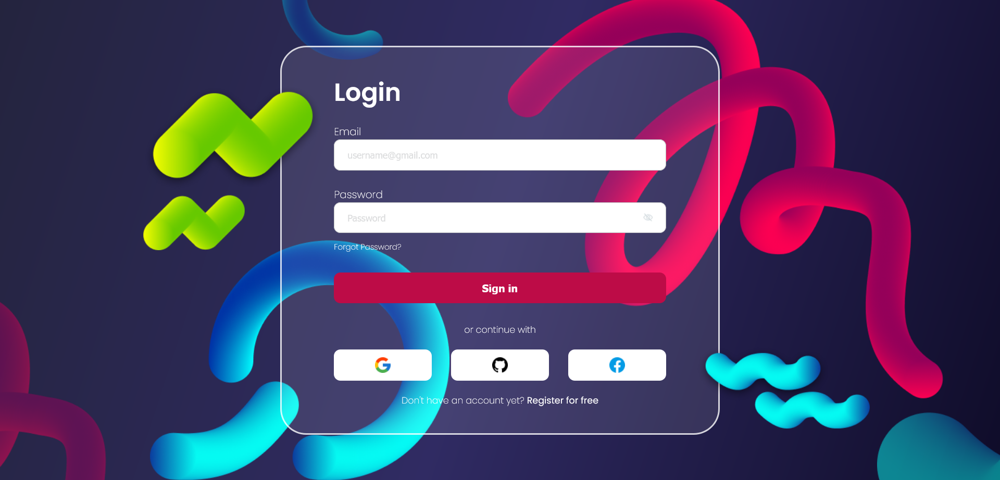

# Glass Effect Login Pag

A simple Glass Effect Login Page

## Table of contents

- [Overview](#overview)
  - [The challenge](#the-challenge)
  - [Screenshot](#screenshot)
  - [Links](#links)
- [My process](#my-process)
  - [Built with](#built-with)
- [Author](#author)
- [Acknowledgments](#acknowledgements)

## Overview

### The challenge

Users should be able to:

- View a simple Glass Effect Login Page.

### Screenshot

### Links

- Live Site URL: [https://app.netlify.com/sites/quiel-glass-effect-login-page/configuration/general](https://app.netlify.com/sites/quiel-glass-effect-login-page/configuration/general)

## My process

### Built with

- HTML
- CSS

## Author

- GitHub - [quielLovesLasagna](https://github.com/quielLovesLasagna)

## Acknowledgements

I would like to thank [Darsh Bhavsar](https://www.figma.com/@draxatelier) for sharing the design.
